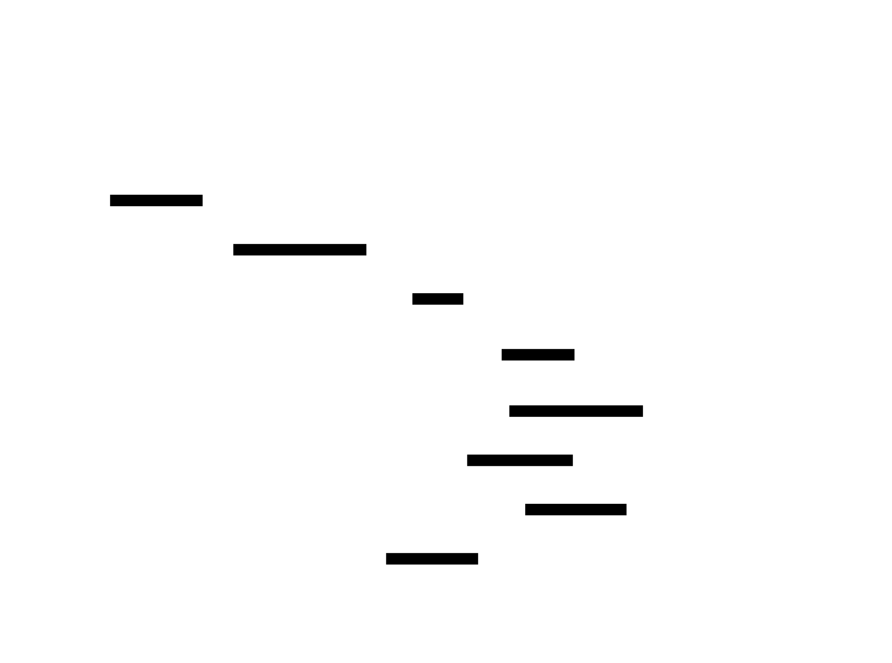

# Tax Workflow Automation — System Design

| | |
|---|---|
| **Prepared for** | CPA firm (Upwork, 2026-04-18) |
| **Prepared by** | Vitalijus Alsauskas · Hyperion AI |
| **Scope** | AI-driven tax return processing — OCR + Claude extraction + ProConnect / DrakeTax export |

## 1. Problem Framing

**The hard part isn't the LLM call** — it's keeping accuracy consistent across document variants and making sure PII never leaks.

Naive AI tax pipelines fail in predictable ways:

- **Messy document variants** — scanned 1099s, prior-year returns with handwritten notes, K-1s with non-standard layouts
- **Silent hallucinations** — the model returns a plausible number that's wrong, it ships to ProConnect, the CPA catches it weeks later
- **PII leaks** — SSNs and ITINs land in LLM provider logs that shouldn't have them

This design makes all three **impossible by construction**: OCR-first reduces hallucination surface, per-field confidence gates route uncertain data to human review, and prompt-level PII redaction keeps sensitive data out of the model provider entirely.

---

## 2. System Diagram

Every extracted field carries a **confidence score**. High-confidence fields flow straight to mapping. Anything below threshold drops into a **human review queue** before it ever reaches ProConnect or DrakeTax.

Source: [`docs/architecture.d2`](docs/architecture.d2)

---

## 3. Tool Choices

| Layer | Pick | Why this | Alternatives considered |
|-------|------|----------|-------------------------|
| Upload UI | Next.js 15 (App Router) | Server Components keep PII off the client, signed upload URLs | Plain React SPA (leaks more data to browser), Streamlit (not production-ready for firm use) |
| Encrypted storage | AWS S3 with SSE-KMS + signed URLs | Managed encryption, audit events via CloudTrail, data residency options | Supabase Storage (fine, fewer compliance controls), Azure Blob (works if you're in Azure already) |
| OCR | AWS Textract | Best-in-class on tables, 1099s, scanned returns | Google Vision (close, weaker on tabular data), Tesseract (free, worse on messy scans) |
| LLM extraction | Claude 3.5 Sonnet (Anthropic API, zero-retention) | Strongest structured extraction, supports JSON mode, zero-retention PII handling | GPT-4o (very close, retention defaults less favorable), local Llama (cheaper but unreliable on financial docs) |
| Confidence scoring | LLM self-score + regex validation | Cheap, interpretable, catches most hallucinations | Fine-tuned classifier (overkill for volume you're at) |
| Review queue | Postgres table + Next.js admin UI | Simple, auditable, CPAs already work in browser | Airtable (not HIPAA-aligned), Retool (ongoing cost, vendor lock-in) |
| Mapping to ProConnect / DrakeTax | Python mapper module per target | Each tax software has quirks, keeping them isolated avoids cross-contamination | Single unified schema (brittle when target changes) |
| Observability | Sentry + structured logs in S3 | Incidents caught fast, immutable audit log for compliance | DataDog (overpriced for a firm), CloudWatch (weak UX) |

---

## 4. Data Flow

### Happy path (~80% of returns)

1. **Upload** — CPA uploads via signed URL; file lands in encrypted S3, audit log entry written
2. **OCR** — worker picks up file, runs Textract, stores raw text + layout metadata
3. **Extract** — Claude returns structured fields with per-value confidence scores
4. **Gate** — fields ≥ threshold flow straight to mapping; below threshold enter review
5. **Map** — Python mapper produces ProConnect- or DrakeTax-ready record
6. **Deliver** — CPA downloads the mapped output when ready

### Low-confidence path (~15-20% of returns)

- Any field below threshold (e.g. **< 0.85 on a $ value**) drops into the review queue
- CPA opens the Review UI with original document region next to extracted value
- CPA corrects or approves; fix logged against field for future prompt tuning
- Only **after human approval** does the field flow to mapping

### Error paths

| Failure | Handling |
|---|---|
| **OCR fails / returns garbage** | Return flagged `unprocessable`, routed to manual-entry queue |
| **LLM timeout or rate limit** | Exponential backoff; fallback to secondary model after 3 failures |
| **S3 upload fails** | Clear error to user; nothing partial stored |
| **Mapping layer rejects a field** | Blocks export; surfaces structured error with "fix field" link |
| **PII leak risk** | Prompts redacted (SSN/ITIN → tokens); any unredactable prompt skips LLM entirely, field goes straight to manual review |

---

## 5. Component Breakdown

| Component | Stack | Responsibility |
|---|---|---|
| **Ingest Service** | FastAPI + signed S3 URLs | Uploads, validation, encryption at rest, audit logging. Nothing touches the LLM here. |
| **OCR Worker** | Celery + AWS Textract | Pulls from S3, parses to text + layout, writes to processing bucket. |
| **Extraction Worker** | Celery + Anthropic SDK | Claude extracts 30-50 fields with JSON output + confidence scores. |
| **Review UI** | Next.js route `/review` | Low-confidence field inspector, inline corrections, audit trail per edit. |
| **Mapping Layer** | `proconnect.py`, `draketax.py` | One module per target isolates format quirks so one doesn't break the other. |
| **Export Service** | FastAPI endpoint | Generates final file in target format when CPA marks return ready. |
| **Audit & Observability** | Sentry + structured logs + immutable S3 | Every action logged, every mutation traceable, breach response ready. |

---

## 6. Implementation Phases

| Phase | Weeks | Ships | Key milestones |
|---|---|---|---|
| **1. Foundation** | 1-2 | End-to-end skeleton for one document type (1099-MISC) | Upload portal, Textract wired up, Claude extracts ~10 fields, basic review UI, deployment pipeline to staging |
| **2. Coverage** | 3-4 | Full field coverage for 5 most common forms | 1040, 1099s (MISC/NEC/INT/DIV), K-1, W-2, Schedule C; ProConnect mapper; polished review UI; load tested at season volume |
| **3. Production** | 5-6 | Second target + observability + handoff | DrakeTax mapper; Sentry→Slack alerts; oncall runbook; knowledge transfer session + recorded walkthrough |

---

## 7. Risks & Mitigations

| # | Risk | Mitigation |
|---|---|---|
| 1 | **Claude hallucinates values** on messy scans, wrong numbers reach ProConnect | Confidence scoring + review queue. Nothing exports without high model confidence OR human approval. Auto-approved fields still logged with source coordinates for retroactive audit. |
| 2 | **PII leaks** through LLM prompts or provider retention | Anthropic zero-retention flag on. SSN/ITIN redacted before prompts (reversible tokens). Audit log of every prompt. Data never leaves your AWS account except the scrubbed LLM call. |
| 3 | **Tax-season volume spike** breaks the pipeline | Celery autoscales on queue depth. Depth alerts at 100. Fallback to Claude Haiku under extreme load so nothing stalls. Load tested at 3× season volume. |
| 4 | **ProConnect / DrakeTax** changes import format mid-season | Mapping layer isolated per target — one format change doesn't break the other. Nightly integration tests against sample imports alert on regressions. |
| 5 | **CPA correction corrupts historical data** | All corrections append-only. Every correction carries user ID + timestamp. Original extraction preserved. Bad corrections replayable from audit log. |

---

## 8. What I Need From You

To move into Phase 1, a few inputs from your side:

- **5-10 real returns** (redacted is fine) — calibrates extraction accuracy on your actual document mix, not synthetic data
- **Test ProConnect or DrakeTax account** — for the mapping layer
- **Field priorities** — which 20-30 fields are must-haves vs. nice-to-haves (I can send a suggested list)
- **Data residency confirmation** — US-only, or flexible?
- **30-minute kickoff call** — to walk this through and tighten scope before any code ships

---

*This document is yours to keep regardless of whether we end up working together. If you hire someone else to build this, the architecture and tool choices here should still save them two weeks of thinking.*
